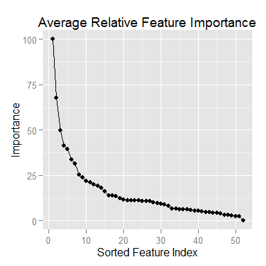

# Predicting Exercise Quality
Daddy The Runner  
August 22, 2015  


***
# Introduction
***
The purpose of this project was to create a machine learning model
that accurately predicts how well a set of exercise volunteers
performed a given exercise.  The data and experiment description
is published in the [Weight Lifting Exercises Dataset](http://groupware.les.inf.puc-rio.br/har in the) 
section of the Human Activity Recognition website. (Velloso 2013)

The random forrest machine learning algorithms was explored and
chosen for this project.  To keep this report consise, some of the
code chunks used have been hidden.  Additionally, some helper
functions were written and used in this project.  All of the
code required to reproduce this report is contained in the
github repository along with this final report.


&nbsp;

***
# Exploratory Data Analysis
***
## Data Set Description
The researchers had six young healthy volunteers perform 10
repetitions of the Unilateral Dumbbell Biceps Curl.  The volunteers
performed the exercise in five different ways which were assigned
class labels A - E.  Class A was used to designate performing the
exercise correctly.  Calsses B through E were used for various
methods of incorrectly performing the exercise.

The researchers collected sensor data from inertial measurement
sensors (IMUs) attached to the exercise equipment and various
locations on the volunteers.  The data set contains over 19,000
samples of over 150 factors.  A 20 sample data set was provided
for grading purposes.


## Data Cleaning and Partitioning
An inspection of the grading data set indicates that the first
seven columns are book keeping values that were removed.
Additionally, several columns of the grading set contained no
data.  Therefore, there was no use keeping any of those columns
in the training set.  The training set was split into a training
set and a validation set using a 75% - 25% split.  The following
table shows the sizes of the data sets after cleaning and
partitioning:

Data Set   | Rows (Samples)          | Columns (Features)
-----------|-------------------------|------------------------
Grading    | 20    | 53
Training   | 14718   | 53
Validation | 4904 | 53


&nbsp;

***
# Model Building
***
The random forest algorithm was chosen because it tends to
perform well according to the class lectures.  However, it can be
computationally expensive.  Therefore, I decided to reduce the
amount of data used to build the model.

## Data Reduction
### Check for Near Zero Variance Factors
First we check for near zero variance factors using the following
code.  No candidates for removal were identified.


```r
## Look for low variance features
nzv.training <- nearZeroVar(training.ds[-ncol(training.ds)])
if (length(nzv.training)==0) {
  cat("\nNo low variance features found.")
} else {
  cat("\nLow Variance Features found:  ", sort(nzv.training))
  nzv.names <- names(which(sapply(training.ds, is.numeric)))[sort(nzv.training)]
  cat("\nFeature names:  ", nzv.names)
}
```

```
## 
## No low variance features found.
```

### Check for Linear Combinations
Next we check for linear combinations of factors using the following
code.  No candidates for removal were identified.


```r
lc.training <- findLinearCombos(training.ds[-ncol(training.ds)])$remove
if(is.null(lc.training)){
  cat("\nNo linear combos found.")
} else {
  lc.names <- names(which(sapply(training.ds, is.numeric)))[sort(lc.training)]
  cat("\nLinear features found:  ", sort(lc.training))
  cat("\nFeature names:\n", lc.names)
}
```

```
## 
## No linear combos found.
```


### Feature Importance
Since the NZV and linear checks failed to identify any candidate
fetaures for removal, I decided to take a different approach to
reducing the training data set.  I decided to use very small (5%)
samples of the trainig data set to quickly create multiple models.
I then used the `varImp` function to determine the relative
importance of each feature in each of the models built.  The
relative importance of each variable was averaged over ten
randomly built models.  For details, see the `selectFeatures` and
`avgImp` helper functions in the `pml-tools.F` file.  The results
of this analysis is shown in the figure 1.


```r
## Get estimates of the importance of each feature
feature.Imp.est <- selectFeatures(training.ds, sampleSize=0.05)
```


```r
## Average the importance over all of the estimates
feature.Imp.avg <- avgImp(feature.Imp.est)
feature.Imp.avg <- 
  tbl_df(data.frame(Feature=rownames(feature.Imp.avg),
                    Importance=feature.Imp.avg$Overall,
                    stringsAsFactors = FALSE))

## Reorder the data from most to least important
feature.Imp.avg <- arrange(feature.Imp.avg, desc(Importance))

## Look at a plot of the importance to see if there is a knee
imp.plot <- ggplot(data=feature.Imp.avg,
                   aes(1:nrow(feature.Imp.avg), Importance))
imp.plot <- imp.plot + geom_line() + geom_point()
imp.plot <- imp.plot + ggtitle("Average Relative Feature Importance")
imp.plot <- imp.plot + xlab("Sorted Feature Index")
imp.plot <- imp.plot + ylab("Importance")
print(imp.plot)
```

 

**Figure 1.** Sorted plot of the average feature importance in building
a random forest model.

Based on the curve in figure 1, I chose to keep only the features
that had an importance score greater than or equal to 25.


```r
## Get a list of features whose avg importance >= 25
keep.features <- feature.Imp.avg %>% 
  filter(Importance >= 25) %>% 
  select(Feature)
keep.features <- keep.features[[1]]
cat("\nThe following features are being kept for model building:\n")
print(keep.features)

## Create the reduced data sets for model building and testing
red.grading.ds <- select(grading.ds, one_of(keep.features))

## Add the classe variable to the list to keep for the training and
## validation data sets
keep.features[length(keep.features)+1] <- "classe"

red.training.ds <- select(training.ds, one_of(keep.features))
red.validation.ds <- select(validation.ds, one_of(keep.features))
```

```
## 
## The following features are being kept for model building:
## [1] "roll_belt"         "pitch_forearm"     "magnet_dumbbell_z"
## [4] "yaw_belt"          "magnet_dumbbell_y" "roll_forearm"     
## [7] "pitch_belt"        "magnet_dumbbell_x"
```


## Random Forest Model
Now that the data sets have been reduced to use only the
`length(keep.features) - 1` most important features, we can build
a fandom forest model using all of the samples in the training set.
Online research indicated using the out-of-bag estimates 
`method="oob"` in the training control results in decreased
computation times.


```r
## Build a model based on the full set of reduced features
set.seed(2745)
fitControl <- trainControl(method="oob", returnData=FALSE)
cat("\nStarting the model training at:  "); print(Sys.time())
```

```
## 
## Starting the model training at:
```

```
## [1] "2015-08-22 16:04:07 EDT"
```

```r
rf.mod.2745 <- train(classe ~ ., data=red.training.ds, method="rf",
                     trControl=fitControl, verbose=FALSE, model=FALSE)
cat("\nFinished the model training at:  "); print(Sys.time())
```

```
## 
## Finished the model training at:
```

```
## [1] "2015-08-22 16:07:03 EDT"
```

The output indicates the final model was built in about three and
a half minutes.

## Model Validation
Now that the model has been built, we can validate it against the
validation data set that was reserved from the original data set.


```r
## Validate the model
rf.mod.val.2745 <- predict(rf.mod.2745, newdata=red.validation.ds)
rf.mod.cm <- confusionMatrix(rf.mod.val.2745, red.validation.ds$classe)
print(rf.mod.cm)
```

```
## Confusion Matrix and Statistics
## 
##           Reference
## Prediction    A    B    C    D    E
##          A 1387    4    1    0    0
##          B    2  930    6    0    3
##          C    5   12  841    5    2
##          D    0    3    7  798    1
##          E    1    0    0    1  895
## 
## Overall Statistics
##                                           
##                Accuracy : 0.9892          
##                  95% CI : (0.9859, 0.9919)
##     No Information Rate : 0.2845          
##     P-Value [Acc > NIR] : < 2.2e-16       
##                                           
##                   Kappa : 0.9863          
##  Mcnemar's Test P-Value : NA              
## 
## Statistics by Class:
## 
##                      Class: A Class: B Class: C Class: D Class: E
## Sensitivity            0.9943   0.9800   0.9836   0.9925   0.9933
## Specificity            0.9986   0.9972   0.9941   0.9973   0.9995
## Pos Pred Value         0.9964   0.9883   0.9723   0.9864   0.9978
## Neg Pred Value         0.9977   0.9952   0.9965   0.9985   0.9985
## Prevalence             0.2845   0.1935   0.1743   0.1639   0.1837
## Detection Rate         0.2828   0.1896   0.1715   0.1627   0.1825
## Detection Prevalence   0.2838   0.1919   0.1764   0.1650   0.1829
## Balanced Accuracy      0.9964   0.9886   0.9888   0.9949   0.9964
```

The results from the confusion matrix analysis indicates that the
out of sample estimate of the overall accuracy is
98.92%.  Additionally, the
spensitivity, specificity, and positve and negative predictive
values are all greater than 97% with most greater than 99%.

## Performance on Grading Set
Without revealing the answers to the grading set (to avoid an
honor code violation), I am able to report that the final model
correctly predicted 19 of the 20 cases.  Using the `type="prob"`
option to the `predict` function, I was able to use the model's
prediction probabilities to identify the second most likely class
for the single incorrect prediction without having to rebuild
the model.

&nbsp;

***
# Conclusions
***

A highly accurate random forest model was created using a relatively
small subset 
(0.15%) of
the available training data.  The final model has a very high out
of sample accuracy estimate.

When we consider the fact that class A represents doing the exercise
correctly and the other four classes all represent incorrect
performances, the final model only incorrectly identified proper
exercise performance 5 times.

Estimated word count: 1278 (includes lines of code)


&nbsp;

***
# References
***
Velloso, E., Bulling, A., Gellersen, H., Ugulino, W., Fuks, H. "[Qualitative Activity Recognition of Weight Lifting Exercises](http://groupware.les.inf.puc-rio.br/work.jsf?p1=11201)". Proceedings of 4th International Conference in Cooperation with SIGCHI (Augmented Human '13). Stuttgart, Germany, ACM SIGCHI, 2013.
